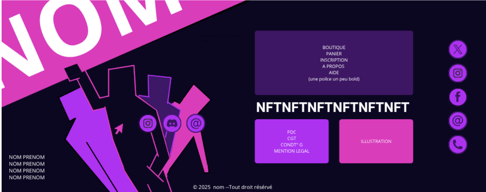
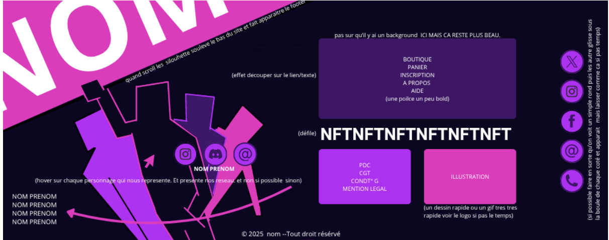
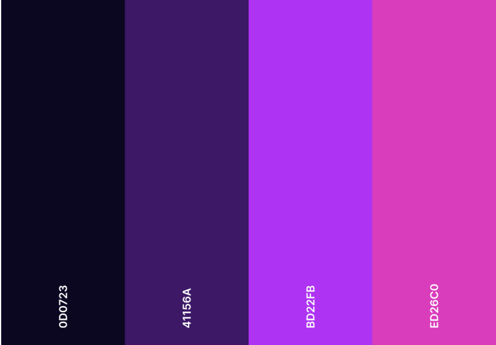
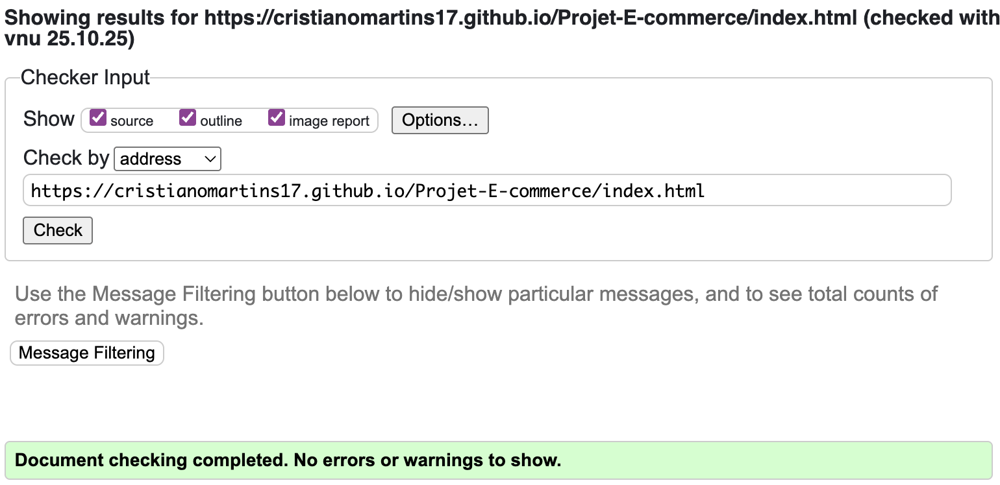

# Projet en Développement d'interface Web (Première année) :
## Réalisation d'un site de E-commerce en groupe 

Notre site : [Not For Teachers](https://cristianoMartins17.github.io/Projet-E-commerce/index.html)

## Membres du groupe :

Etudiant 1 :  [MARTINS Cristiano](mailto:critiano.martins@edu.univ-fcomte.fr?subject=SAE_1_05_06)
Etudiant 2 :  [MAHAMANE Mansourah] ()
Etudiant 3 : [TACHERIFT Sofiane]()  
Etudiant 4 : [SAMIL Omeyya]()

## Présentation du projet
Ce dépôt correspond à un site web créé avec les languages HTML/CSS/JS dans le cadre d'un projet en Développement d'interface Web à l'IUT de Belfort-Montbéliard.

Nous devions réaliser un site web d'e-commerce d'après ces [consignes](https://projetdevwebs1.web.app/index.html).

Nous avons décidez de réaliser un site web dans lequel nous "vendons" des NFT de nos professeurs au sein de l'IUT.
Pour cela, nous avons demander leur autorisation pour utiliser leur image (photos trouvé sur Internet).

## Choix de conception
Pour la conception du site, nous nous sommes inspirés de différents designs trouvées sur Codepen, <a href="https://www.webdesign-inspiration.com/fr">Webdesign Inspiration </a> et <a href="https://www.awwwards.com/websites">Awwards</a>.

<strong> Nos inspirations : </strong>
- Carrousel (Accueil) : <a href="https://www.youtube.com/watch?v=Xh-wIMqohD0">Youtube</a>
- Carte (Accueil) : <a href="https://codepen.io/AbubakerSaeed/pen/EJrRvY">Codepen</a>

<strong> Nos concepts de design original : (réalisé par Mansourah sur Canva) : </strong>

<strong> Palette :</strong>

## Développement site web et validation des pages
<strong>Page d'accueil 
Auteur : MARTINS Cristiano</strong> 
Vérification W3C :

  
<strong>Page panier 
Auteur : SAMIL Omeyya</strong> 
Vérification W3C :

  
<strong>Page à propos 
Auteur : TACHERIFT Sofiane</strong> 
Vérification W3C :

  
<strong>Page boutique 
Auteur : MAHAMANE Mansourah</strong> 
Vérification W3C :

## Répartition du Travail
Commits : 

