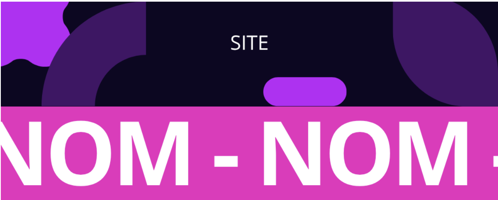

# Projet en Développement d'interface Web (Première année) :
## Réalisation d'un site de E-commerce en groupe 

Notre site : [Not For Teachers](https://cristianoMartins17.github.io/Projet-E-commerce/index.html)

## Membres du groupe :

Etudiant 1 :  [MARTINS Cristiano](mailto:critiano.martins@edu.univ-fcomte.fr?subject=SAE_1_05_06)  
Etudiant 2 :  [MAHAMANE Mansourah]()  
Etudiant 3 :  [TACHERIFT Sofiane]()  
Etudiant 4 :  [SAMIL Omeyya](omeyya.samil@edu.univ-fcomte.fr)

## Présentation du projet
Ce dépôt correspond à un site web créé avec les langages HTML/CSS/JS dans le cadre d'un projet en développement d'interface web à l'IUT de Belfort-Montbéliard.

Nous devions créer un site web d'e-commerce d'après ces [consignes](https://projetdevwebs1.web.app/index.html).

Nous avons décidé de créer un site web sur lequel nous "vendons" des NFT de nos professeurs de l'IUT.
Pour cela, nous avons demandé l'autorisation pour utiliser leur image (photos trouvées sur Internet).

## Choix de conception
Pour la conception du site, nous nous sommes inspirés de différents designs trouvés sur Codepen, <a href="https://www.webdesign-inspiration.com/fr">Webdesign Inspiration </a> et <a href="https://www.awwwards.com/websites">Awwards</a>.

<strong> Nos inspirations : </strong>
- Carrousel (Accueil) : <a href="https://www.youtube.com/watch?v=Xh-wIMqohD0">Youtube</a>
- Carte (Accueil) : <a href="https://codepen.io/AbubakerSaeed/pen/EJrRvY">Codepen</a>

<strong> Nos concepts de design originaux (réalisé par Mansourah sur Canva) : </strong>

<strong> Palette :</strong>     

## Développement site web et validation des pages
<strong>Page d'accueil 
Auteur : MARTINS Cristiano</strong> 
Vérification W3C :

  
<strong>Page panier 
Auteur : SAMIL Omeyya</strong> 
Vérification W3C :

  
<strong>Page à propos 
Auteur : TACHERIFT Sofiane</strong> 
Vérification W3C :

  
<strong>Page boutique 
Auteur : MAHAMANE Mansourah</strong> 
Vérification W3C :

## Répartition du Travail
Commits : 

Cristiano :
- Idée du concept de NFT + nom 
- Moodboard 
- Organisation du projet :
    - Planification des tâches 
    - Répartition des tâches 
- Fonctionnement des barres de navigation 
    - Hover sur les liens 
    - Animation de défilement (pas le style néon, seulement son fonctionnement) 
    - Hover sur le titre 
    - Toute la barre hamburger 
- Le contenu de la page d'accueil (sauf le fond et le pied de page, légèrement adaptés).
- Le style des titres (rose aspect « néon »)

Mansourah :

Omeyya :

Sofiane :
-Organisation et réalisation de la page à propos : 
    -Hover et ombre en rose sur les élements 
    -Logo de l'application imaginaire "NotProfHelp" 
    -idée du fait que çe soit un site de nft pour une cause caricative 
    -formulaire pour s'inscire ( Il ne récupère pas les données ) 
-Réalisation des bas-de-page: 
    -fonctionnement des liens pour aller sur les autres pages 
    -Style et réalisation des boutons pour aller sur nos réseaux 
    

